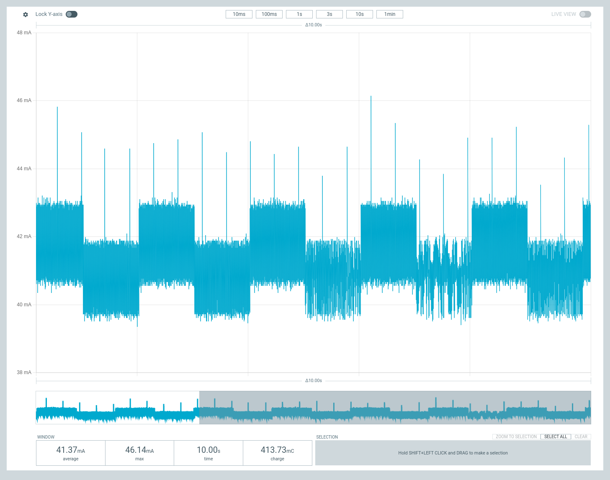
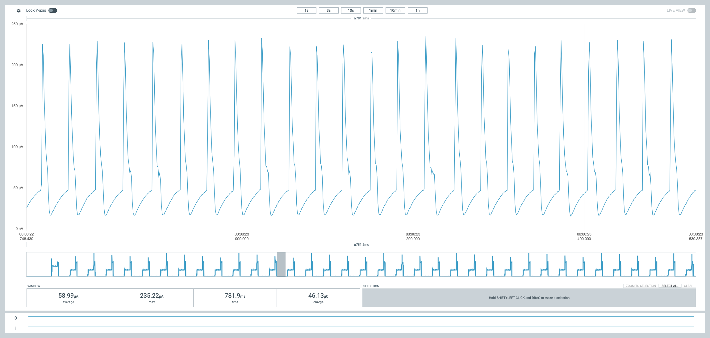
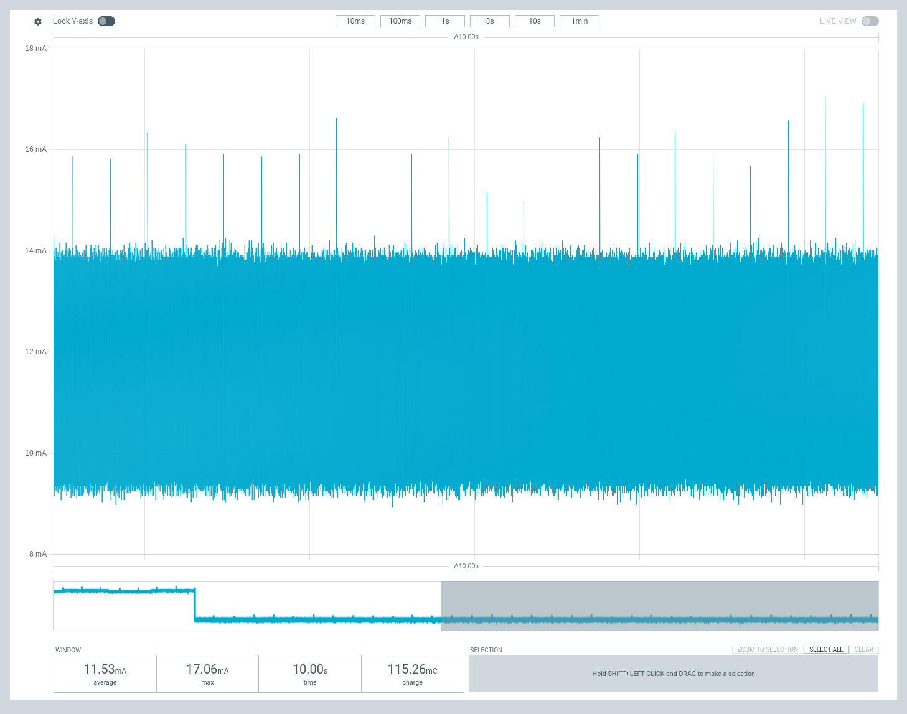
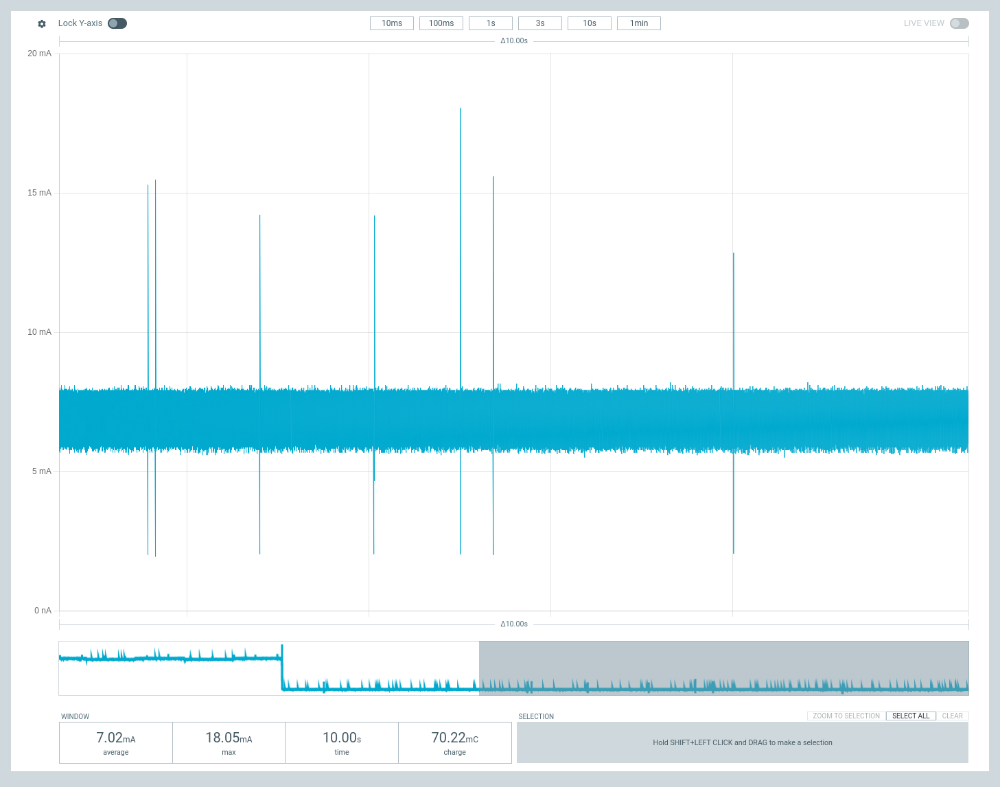
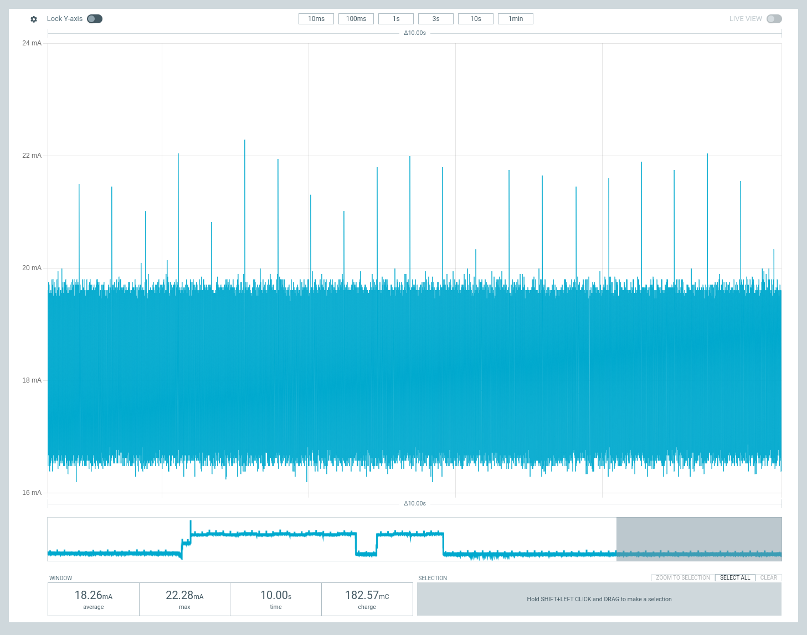

# Portenta C33 Sleep Measurements

The screenshots below are taken from the nRF Power Profiler application using a Nordic PPK2 while running the blink sketch on the same board. 

#### Normal operating conditions

#### Deep Sleep
##### Peripherals off

##### Peripherals on

#### Sleep Mode 
##### Peripherals off

##### Peripherals on

